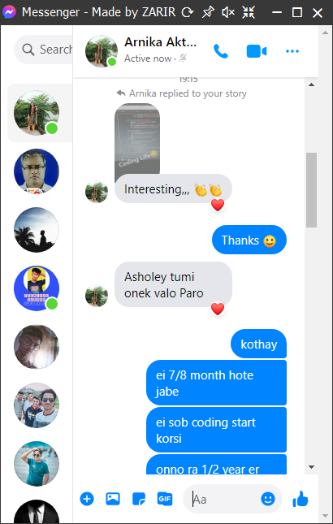
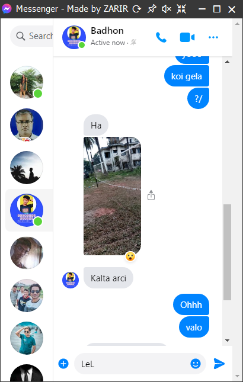

# Messenger-For-PC
> # Features:
> 1. Simple View.
> 2. Mute supported.
> 3. Pin supported (Stay on Top).
> 4. Popup mode available.
>> 4.1. Fully Dragable. 
>> 4.2. Shows a red dot if any unseen message found.
# Download
## <a href="https://github.com/dev-zarir/Messenger-For-PC/releases/download/msnger/Messenger.exe">Download For Windows</a>
# Screenshots

 

